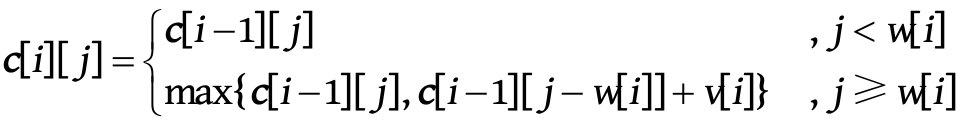

给定 n 种物品，每种物品都有重量 `w[i]` 和价值 `v[i]` ，每种物品都只有一个。
另外，背包容量为 W 。
求解在不超过背包容量的情况下将哪些物品放入背包，才可以使背包中的物品价值之和最大。
每种物品只有一个，要么不放入（0），要么放入（1），因此称之为01背包。

重量+容量 => 价格+资金

假设第 i 阶段表示处理第 i 种物品，第 i -1阶段表示处理第 i -1种物品，
则当处理第 i 种物品时，前 i -1种物品已处理完毕，只需考虑第 i -1阶段向第 i 阶段的转移。

状态表示： `c [i][j]` 表示将前 i 种物品放入容量为 j 的背包中获得的最大价值。

第 i 种物品的处理状态包括以下两种。

· 不放入：放入背包的价值不增加，问题转化为“将前 i -1种物品放入容量为 j 的背包中获得的最大价值”，最大价值为 `c[i-1][j]`。

· 放入：在第 i 种物品放入之前为第 i -1阶段，相当于从第 i -1阶段向第 i 阶段转化。
问题转化为“将前 i -1种物品放入容量为 `j-w[i]` 的背包中获得的最大价值”，
此时获得的最大价值就是 `c[i-1][j-w[i]]`，再加上放入第 i 种物品获得的价值 `v[i]`，
总价值为 `c[i-1][j-w[i]] + v[i]`。

若背包容量不足，则肯定不可以放入，所以价值仍为前 i- 1种物品处理后的结果；
若背包容量充足，则考察在放入、不放入哪种情况下获得的价值更大。



---

1）求解放入背包的物品最大价值

```c++
for (int i = 1; i <= n; i++ )
    for (int j = 1; j <= W; j++)
        if (j < w[i])
            dp[i][j] = dp[i-1][j];
        else
            dp[i][j] = max(dp[i-1][j], dp[i-1][j-w[i]] + v[i] );
cout << "max value: " << dp[n][W] << endl;
```

```c++
// 压缩
for (int i = 1; i <= n; i++ )
for (int j = 1; j <= W; j++)
if (j < w[i])
dp[j] = dp[j];
else
dp[j] = max(dp[j], dp[j-w[i]] + v[i] );
cout << "max value: " << dp[n][W] << endl;
```

2）最优解构造(逆向递推最优解)

```c++
int j = W;
for (int i = n; i > 0; i--)
    if (dp[i][j] > dp[i-1][j]) {
        x[i] = 1;
        j -= w[i];
    }
    else
        x[i] = 0;

cout << "added: ";
for (int i = 1; i <= n; i++)
    if (x[i] == 1)
        cout << i << " ";
```