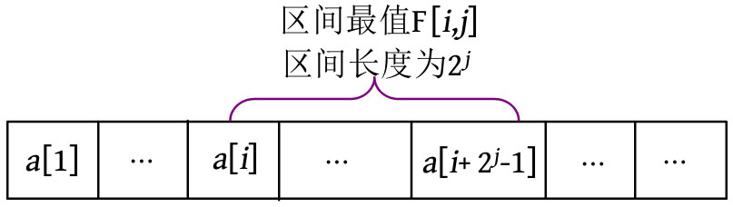

ST（Sparse Table，稀疏表）算法采用了倍增思想，
在 O ( n log n )时间构造一个二维表之后，
可以在 O (1)时间在线查询`[ l , r ]`区间的最值，
有效解决在线RMQ（Range Minimum/Maximum Query，区间最值查询）问题。

设`F[ i , j ]`表示`[ i , i +2^(j -1)]`区间的最值，区间长度为2 j 。



根据倍增思想，长度为2 j 的区间可被分成两个长度为2^(j -1) 的子区间，然后求两个子区间的最值即可。
递推公式：`F[ i , j ]=max(F[ i , j -1], F[ i +2^(j-1) , j -1])`。


```c
void ST_create() {
    // 从1开始
    // 区间长度为0
    for (int i = 1; i <= n; i++)
        F[i][0] = a[i];
    
    int k = log2(n);
    for (int j = 1; j <= k; j++)    // 枚举区间长度
        for (int i = 1; i <= n-(1<<j)+1; i++)   // 1<<(j-1) 上一级区间长度
            // 从i开始, 第二个坐标 从i 开始跳过 上一级区间长度, 利用之前的计算结果
            F[i][j] = max(F[i][j-1], F[i + (1<<(j-1))][j-1]);
}
```

```c
int ST_query(int l, int r) {
    int k = log2(r-l+1);    // 最近的区间层级
    // l...l+2^k-1  r+2^k-1...r+2^k+1 + 2^k-1 = r
    return max(F[l][k],F[r - (1<<k) + 1][k]);
}
```

---

创建ST时，初始化需要 O ( n )时间，两个 for 循环需要 O ( n log n )时间，总时间复杂度为 O ( n log n )。区间查询实际上是查表的过程，计算
k 值后从表中读取两个数取最大值即可，因此查询的时间复杂度为 O (1)。一次建表，多次使用，这种查表法就是动态规划。