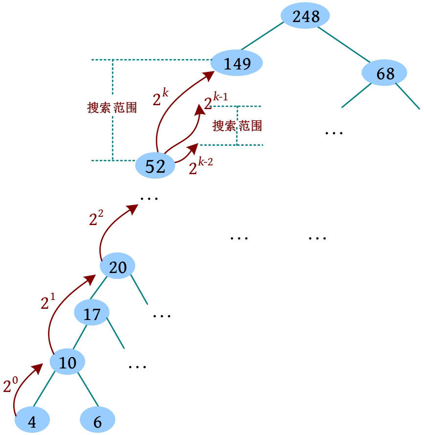

任意整数均可被表示成若干个2的次幂项之和。

倍增，顾名思义就是成倍增加。
若问题的状态空间特别大，则一步步递推的算法复杂度太高，可以通过倍增思想，
只考察2的整数次幂位置，快速缩小求解范围，直到找到解。

---

例如在一棵树中，每一个节点的祖先都比该节点大，要查找4的祖先中等于 x 的祖先节点。最笨的办法就是一个一个地向上比较祖先节点，判断哪一个等于
x 。若树特别大，则搜索效率很低。虽然祖先是有序的，但不是按顺序存储的，无法得到中间节点的下标，因此不可以采用普通的二分搜索，这时怎么办呢？答案是采用倍增思想：将
x 和当前节点向上2 i 个节点进行比较，若 x 大于该节点，则向上跳2 i 个节点，加大增量2 i +1 ，继续比较；若 x 小于该节点，则减少增量2
i -1 ，继续比较，直到相等，返回查找成功；或者增量减为2 0 仍不相等，返回查找失败。

